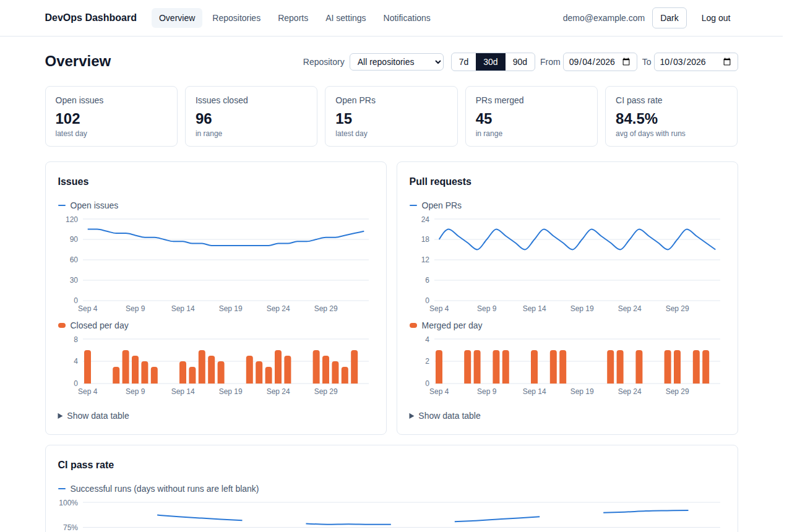
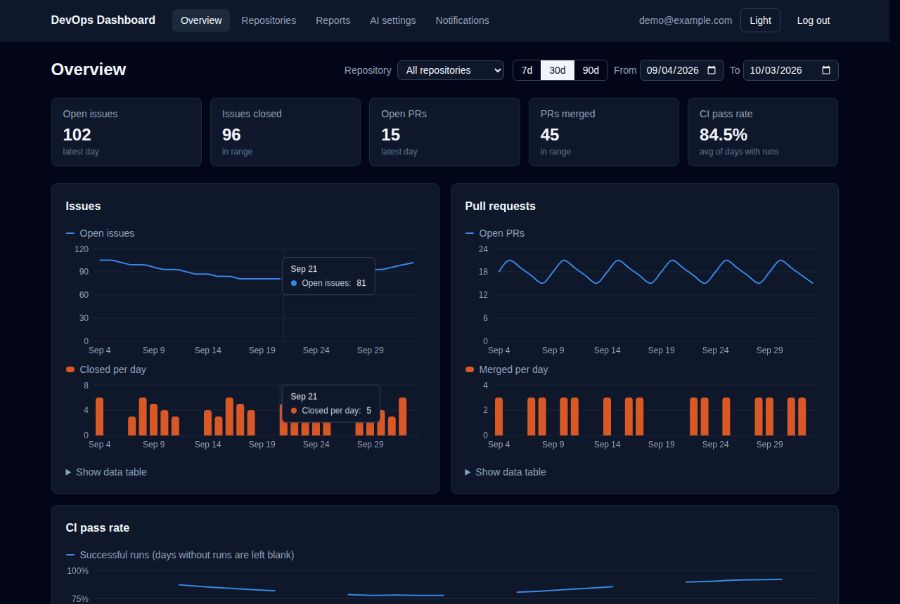
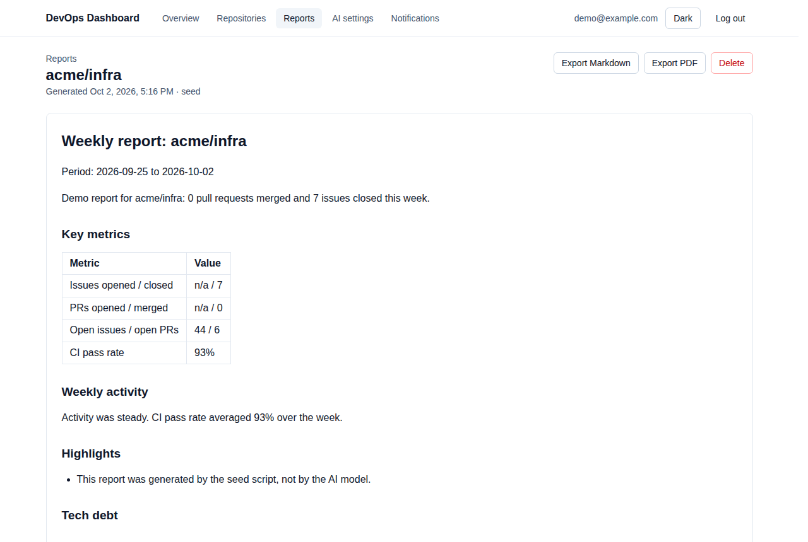
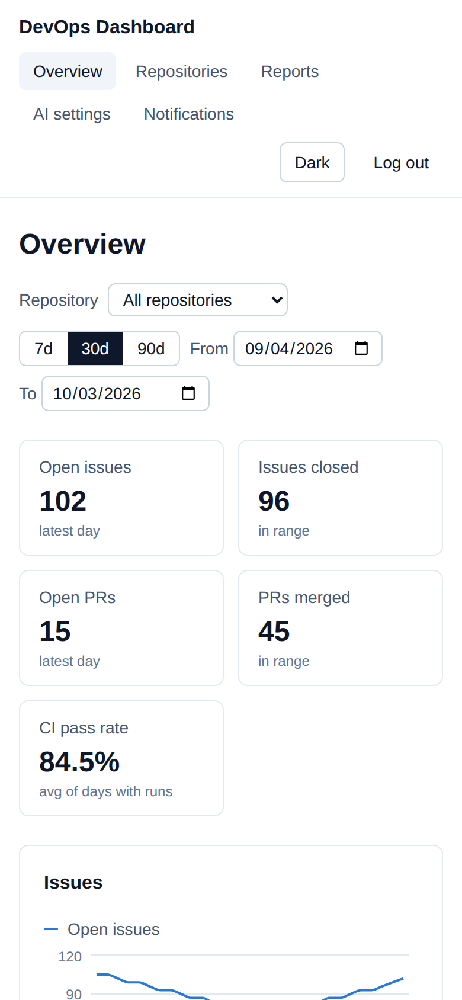
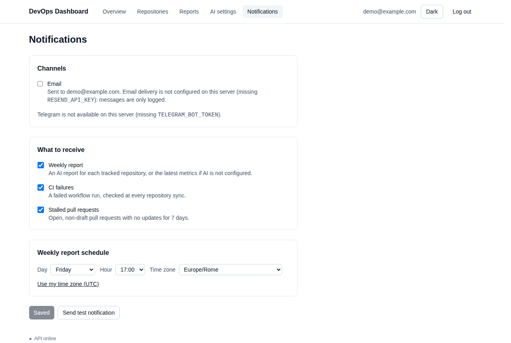
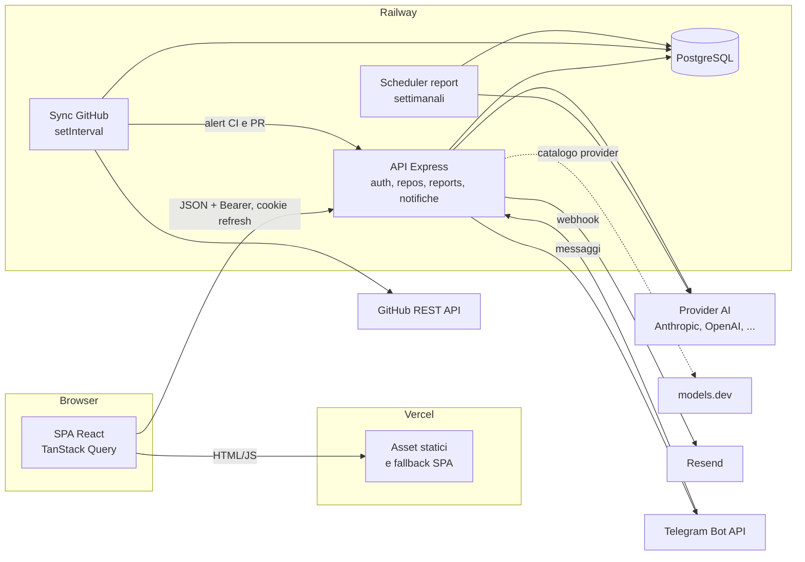
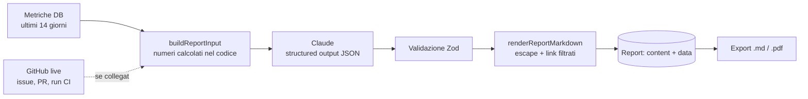

# DevOps Dashboard

[](https://github.com/JakiWZ/devops-dashboard/actions/workflows/ci.yml)

Dashboard full-stack che monitora repository GitHub (issue, pull request, pass rate della CI) e genera report settimanali con l'AI del provider che preferisci, inviati per email o Telegram.
Progetto dimostrativo sviluppato interamente con Claude Code, a fasi, una PR per fase. Specifica completa in [`SPEC.md`](SPEC.md).

**Demo live:** _TODO: link dopo il primo deploy su Vercel e Railway (vedi [Deploy](#deploy))._ In locale servono solo Node e Postgres, con utenti e dati demo dal seed (vedi [Setup locale](#setup-locale)).



| Tema scuro, con crosshair sincronizzato                       | Report AI                                        | Mobile                                                                                |
| ------------------------------------------------------------- | ------------------------------------------------ | ------------------------------------------------------------------------------------- |
|  |  |  |



## Cosa fa

- **Auth completa**: registrazione, login, refresh token ruotati in cookie httpOnly, ruoli `USER`/`ADMIN`, reset password via email.
- **GitHub**: ogni utente collega un token in sola lettura e sceglie i repository; un sync periodico salva metriche giornaliere (issue aperte e chiuse, PR aperte e merged, pass rate della CI).
- **Dashboard**: KPI, grafici con filtro per repository e intervallo di date, tabella dati accessibile, tema chiaro e scuro, mobile.
- **Report AI**: riassunto settimanale, tech debt e priorità, con un provider a scelta tra quelli del catalogo [models.dev](https://models.dev) (Anthropic, OpenAI, Google, DeepSeek...). Storico, export Markdown e PDF.
- **Notifiche**: report settimanale nel giorno, ora e fuso scelti, alert su CI fallite e PR ferme, via email (Resend) e bot Telegram.

## Stack

| Layer    | Tecnologia                                                                                                           |
| -------- | -------------------------------------------------------------------------------------------------------------------- |
| Frontend | React 19.2, TypeScript 5.9, Vite 8.3, Tailwind CSS 4.3, React Router 8.4, TanStack Query 5, Recharts 3, Zod 4 (mini) |
| Backend  | Node.js 22, Express 5.2, TypeScript 5.9, Zod 4, Pino 10, Octokit 22, Vercel AI SDK 7, SDK Anthropic                  |
| Database | PostgreSQL 16, Prisma 6.19                                                                                           |
| Test     | Jest 30 + Supertest 7 (backend), Vitest 5 (frontend), Playwright 1.63 (E2E)                                          |
| CI/CD    | GitHub Actions (lint, typecheck, test, build, E2E, immagine Docker), deploy su Railway (API) e Vercel (SPA)          |

## Architettura



API, sync e scheduler girano nello stesso processo Node: un solo servizio da deployare e da pagare. I servizi sono costruiti una volta in `createServices()` e condivisi tra route e job (vedi "Trade-off").

```
frontend/   React + Vite        src/{api,auth,components,pages,hooks,lib}, e2e/ (Playwright), vercel.json
backend/    Express + Prisma    src/{routes,controllers,services,middleware,lib,config}, prisma/, Dockerfile, railway.json
.github/workflows/  ci.yml (verifiche su ogni push), deploy.yml (deploy dopo una CI verde su main)
docs/screenshots/   immagini di questo README
```

## Setup locale

Prerequisiti: Node 22, npm, PostgreSQL 16 in locale (o `docker run -e POSTGRES_PASSWORD=dev -p 5432:5432 postgres:16`).

```bash
# 1. Backend
cd backend
npm install
cp .env.example .env          # imposta DATABASE_URL, TEST_DATABASE_URL e JWT_ACCESS_SECRET
npx prisma migrate dev        # applica le migrazioni e genera il client
DATABASE_URL=<TEST_DATABASE_URL> npx prisma migrate deploy   # prepara il DB dei test
npm run db:seed               # 2 utenti demo, 3 repository, 90 giorni di metriche
npm run dev                   # http://localhost:4000/api/health

# 2. Frontend (altro terminale)
cd frontend
npm install
npm run dev                   # http://localhost:5173 (proxy /api -> :4000)
```

In ogni package: `npm run lint`, `npm run typecheck`, `npm test`, `npm run build`.

Per provare l'immagine di produzione del backend: `docker build -t devops-dashboard-api backend`, poi `docker run --env-file backend/.env -e NODE_ENV=production -p 4000:4000 devops-dashboard-api` (con un `DATABASE_URL` raggiungibile dal container).

Test E2E (dal frontend, con Postgres attivo e il DB di `backend/.env` migrato e con il seed):

```bash
cd frontend
npx playwright install chromium   # una volta
npm run test:e2e                  # avvia backend (:4000) e Vite (:5173) se non sono già attivi
```

La generazione AI nel test E2E è intercettata (serve una chiave AI); login, navigazione ed export usano il backend vero.
I test backend sono di integrazione e **svuotano** il database indicato in `TEST_DATABASE_URL`: usa un DB dedicato.

Utenti demo creati dal seed (solo per sviluppo): `demo@example.com` (ADMIN) e `user@example.com` (USER), password `demo-password`.

### Collegare GitHub

1. Imposta `SECRETS_ENC_KEY` nel `.env` (comando di generazione in `.env.example`; il vecchio nome `GITHUB_TOKEN_ENC_KEY` è ancora accettato). Senza chiave le route GitHub rispondono `503`.
2. Crea un [fine-grained personal access token](https://github.com/settings/personal-access-tokens/new) con accesso in sola lettura a **Metadata**, **Issues**, **Pull requests** e **Actions** sui repository da monitorare.
3. Dopo il login: `PUT /api/github/token` con `{ "token": "github_pat_..." }`, poi `POST /api/repos` con `{ "fullName": "owner/nome" }` e `POST /api/repos/:id/sync`.

Il sync automatico gira nel processo dell'API ogni `SYNC_INTERVAL_MINUTES` (default 360, `0` lo disattiva).

### Report AI

1. Scegli il provider AI. Due strade, combinabili:
   - **Default del server**: `AI_PROVIDER` (id del catalogo [models.dev](https://models.dev), es. `anthropic`, `openai`, `google`, `deepseek`, `zai-coding-plan`), `AI_MODEL` e `AI_API_KEY` nel `.env`. Le variabili `ANTHROPIC_API_KEY`/`ANTHROPIC_MODEL` della Fase 4 restano valide con `AI_PROVIDER=anthropic`.
   - **Chiave per utente** (richiede `SECRETS_ENC_KEY`): `GET /api/ai/providers` per la lista, `POST /api/ai/verify { provider, apiKey }` per verificare la chiave e ottenere i modelli, `PUT /api/ai/credential { provider, apiKey, model }` per salvarla. Chi ha una sua chiave usa quella, gli altri il default del server.

   Senza nessuna chiave `POST /api/reports` risponde `503 AI_NOT_CONFIGURED`; storico ed export funzionano comunque (il seed crea un report demo per repository).

2. `POST /api/reports` con `{ "repositoryId": "..." }`: la risposta arriva in 30-90 secondi.

Come nasce un report:



Variabili: `AI_PROVIDER` (default `anthropic`), `AI_MODEL` (default `claude-opus-5-5` per Anthropic, obbligatoria per gli altri), `AI_API_KEY`, `REPORT_EFFORT` e `REPORT_FALLBACKS` (solo Anthropic, default `high` e `true`), `REPORT_LANGUAGE` (default `English`), `REPORT_RATE_LIMIT` (generazioni per IP all'ora, default 10), `AI_KEY_CHECK_RATE_LIMIT` (verifiche di chiavi per IP ogni 15 minuti, default 20).

### Notifiche

Dalla pagina **Notifications** ogni utente sceglie i canali (email, Telegram), cosa ricevere (report settimanale, CI fallite, PR bloccate) e quando arriva il report (giorno, ora e fuso orario).

- **Report settimanale**: lo scheduler nel processo dell'API controlla ogni `NOTIFICATION_CHECK_MINUTES` (default 5, `0` lo disattiva) chi è nella sua ora. Per ogni repository genera un report AI (chiave dell'utente o default del server) e invia riassunto e link; senza AI invia le ultime metriche. Se il server era spento nell'ora scelta, il report viene recuperato entro 24 ore, poi si aspetta la settimana dopo.
- **Alert**: dopo ogni sync (automatico o manuale) si notificano le run CI fallite nelle ultime 24 ore e le PR aperte, non bozza, ferme da almeno 7 giorni. Ogni evento è notificato una sola volta (tabella `NotificationEvent`).
- **Email**: usa Resend come il reset password (`RESEND_API_KEY`, `EMAIL_FROM`). Senza chiave le email finiscono solo nei log.
- **Telegram**:
  1. Crea un bot con [@BotFather](https://t.me/BotFather) e imposta `TELEGRAM_BOT_TOKEN` e `TELEGRAM_BOT_USERNAME` (senza `@`).
  2. Scegli un segreto casuale per `TELEGRAM_WEBHOOK_SECRET` e registra il webhook (serve un URL pubblico HTTPS, quindi dopo il deploy o con un tunnel):
     ```bash
     curl "https://api.telegram.org/bot$TELEGRAM_BOT_TOKEN/setWebhook" \
       -d url=https://<backend>/api/telegram/webhook \
       -d secret_token=$TELEGRAM_WEBHOOK_SECRET \
       -d 'allowed_updates=["message"]'
     ```
  3. Nella pagina Notifications, "Connect Telegram" apre il bot con un codice monouso valido 15 minuti: premendo Start la chat viene collegata. `/stop` nel bot la scollega; se l'utente blocca il bot, la chat viene scollegata al primo invio fallito.

Variabili: `TELEGRAM_BOT_TOKEN`, `TELEGRAM_BOT_USERNAME`, `TELEGRAM_WEBHOOK_SECRET`, `NOTIFICATION_CHECK_MINUTES` (default 5), `NOTIFICATION_TEST_RATE_LIMIT` (notifiche di prova per IP ogni 15 minuti, default 5).

## Deploy

Il deploy è automatico: dopo una CI verde su `main`, il workflow [`deploy.yml`](.github/workflows/deploy.yml) pubblica prima il backend su Railway (le migrazioni girano prima dell'avvio della nuova versione) e poi il frontend su Vercel. Finché segreti e variabili non sono configurati, i due job si saltano con un avviso invece di fallire. Si può lanciare anche a mano da Actions → Deploy → Run workflow.

> **TODO (maintainer):** servono un account [Railway](https://railway.com) e uno [Vercel](https://vercel.com). Nessun deploy reale è stato fatto durante lo sviluppo: l'immagine Docker è verificata in CI (build, migrazioni dal container e health check contro Postgres), mentre `backend/railway.json` e `frontend/vercel.json` seguono la documentazione delle due piattaforme ma non sono ancora stati provati su un progetto vero.

### 1. Backend e database su Railway

1. Crea un progetto e aggiungi un database **PostgreSQL**.
2. Aggiungi un servizio vuoto (Empty Service, non collegato al repository: a deployarlo è GitHub Actions, solo dopo la CI verde) e chiamalo ad esempio `api`. Railway costruisce `backend/Dockerfile` come indicato in `backend/railway.json`, lancia `prisma migrate deploy` prima di ogni rilascio e controlla `/api/health`.
3. Variabili del servizio (Settings → Variables):

   | Variabile                                                                | Valore                                                                            |
   | ------------------------------------------------------------------------ | --------------------------------------------------------------------------------- |
   | `DATABASE_URL`                                                           | `${{Postgres.DATABASE_URL}}` (riferimento al database del progetto)               |
   | `NODE_ENV`                                                               | `production`                                                                      |
   | `JWT_ACCESS_SECRET`                                                      | stringa casuale di almeno 32 caratteri (comando in `backend/.env.example`)        |
   | `SECRETS_ENC_KEY`                                                        | 32 byte in base64 (comando in `backend/.env.example`); senza, GitHub resta spento |
   | `CORS_ORIGIN`, `APP_URL`                                                 | URL del frontend su Vercel, es. `https://devops-dashboard.vercel.app`             |
   | `AI_PROVIDER`, `AI_MODEL`, `AI_API_KEY`                                  | provider AI di default (facoltativo: ogni utente può usare la sua chiave)         |
   | `RESEND_API_KEY`, `EMAIL_FROM`                                           | email di reset password e notifiche                                               |
   | `TELEGRAM_BOT_TOKEN`, `TELEGRAM_BOT_USERNAME`, `TELEGRAM_WEBHOOK_SECRET` | bot delle notifiche (vedi [Notifiche](#notifiche))                                |

   `PORT` la imposta Railway. Le altre variabili hanno default sensati (elenco completo in `backend/.env.example`).

4. Settings → Networking → **Generate Domain**: è l'URL pubblico dell'API.
5. Crea un token di progetto (Project Settings → Tokens).

### 2. Frontend su Vercel

1. Crea un progetto collegato a questo repository con **Root Directory** `frontend` (framework Vite rilevato da `vercel.json`). I deploy da Git sono disattivati in `vercel.json` (`git.deploymentEnabled: false`): li fa GitHub Actions dopo la CI.
2. Environment Variables (Production): `VITE_API_URL` = URL dell'API su Railway, senza `/api` finale.
3. Crea un token (Account Settings → Tokens) e annota `orgId` e `projectId` (Project Settings → General, o `.vercel/project.json` dopo `vercel link`).

### 3. Segreti su GitHub

In Settings → Environments → `production` (o a livello di repository):

| Tipo      | Nome                | Valore                       |
| --------- | ------------------- | ---------------------------- |
| Secret    | `RAILWAY_TOKEN`     | token di progetto Railway    |
| Variabile | `RAILWAY_SERVICE`   | nome del servizio, es. `api` |
| Secret    | `VERCEL_TOKEN`      | token Vercel                 |
| Variabile | `VERCEL_ORG_ID`     | `orgId` del progetto         |
| Variabile | `VERCEL_PROJECT_ID` | `projectId` del progetto     |

### 4. Dopo il primo deploy

- Registra il webhook Telegram sull'URL di Railway (comando in [Notifiche](#notifiche)).
- Opzionale ma consigliato: un **dominio tuo** con frontend e API sullo stesso sito (es. `app.example.com` e `api.example.com`). Con i domini di default `*.vercel.app` e `*.up.railway.app` il cookie del refresh token è di terze parti, e i browser che le bloccano (Safari, Chrome con la protezione attiva) fanno ripetere il login a ogni ricarica. Vedi "Trade-off".
- Aggiorna il link della demo in cima a questo README.

## Prestazioni

Requisiti della specifica: Lighthouse > 90 e API sotto i 300 ms di media. Misurati in locale sul build di produzione (`vite preview` + `node dist/server.js` con `NODE_ENV=production`), con i dati del seed, Lighthouse 13 e il profilo mobile di default (CPU 4x più lenta, rete 4G lenta).

| Pagina       | Performance mobile | Performance desktop | Accessibility | Best practices | SEO |
| ------------ | ------------------ | ------------------- | ------------- | -------------- | --- |
| Login        | 99                 | 100                 | 100           | 96             | 100 |
| Overview     | 92                 | 100                 | 100           | 100            | 100 |
| Repositories | 98                 | 100                 | 100           | 100            | 100 |
| Reports      | 97                 | 100                 | 100           | 100            | 100 |

Il 96 di best practices sulla login è il `401` del tentativo di refresh in console quando non c'è una sessione.

Tempi delle API (stessa macchina, 22 richieste sequenziali per endpoint dopo 3 di riscaldamento): tutte le letture stanno sotto i 10 ms di media, per esempio `GET /api/repos` 4,4 ms, `GET /api/repos/:id/metrics` su 90 giorni 6,6 ms, `GET /api/reports/:id` 3,5 ms. Le eccezioni sono volute: il login costa ~330 ms perché bcrypt a 12 round è lento apposta, e `POST /api/reports` dura 30-90 s perché aspetta il modello AI. In produzione si aggiunge la latenza di rete verso Railway.

## API

| Metodo | Path                               | Descrizione                                                                               |
| ------ | ---------------------------------- | ----------------------------------------------------------------------------------------- |
| GET    | `/api/health`                      | Stato API e database. `200` se il DB risponde, `503` (`degraded`) altrimenti              |
| POST   | `/api/auth/register`               | `{ email, password }` → `201 { user, accessToken }` + cookie refresh                      |
| POST   | `/api/auth/login`                  | `{ email, password }` → `200 { user, accessToken }` + cookie refresh                      |
| POST   | `/api/auth/refresh`                | Usa il cookie `refresh_token`, lo ruota e restituisce un nuovo access token               |
| POST   | `/api/auth/logout`                 | Revoca la sessione (family del refresh token) e cancella il cookie                        |
| GET    | `/api/auth/me`                     | Utente corrente (`Authorization: Bearer <accessToken>`)                                   |
| POST   | `/api/auth/forgot-password`        | `{ email }` → sempre `202`, invia il link se l'utente esiste                              |
| POST   | `/api/auth/reset-password`         | `{ token, password }` → `204`, revoca tutte le sessioni                                   |
| GET    | `/api/users`                       | Lista utenti, solo ruolo `ADMIN`                                                          |
| GET    | `/api/github`                      | Stato del collegamento GitHub `{ configured, connected, login }`                          |
| PUT    | `/api/github/token`                | `{ token }`: verifica il PAT su GitHub e lo salva cifrato                                 |
| DELETE | `/api/github/token`                | Scollega GitHub (`204`)                                                                   |
| GET    | `/api/repos`                       | Repository tracciati, con l'ultima metrica                                                |
| GET    | `/api/repos/available`             | Repository GitHub dell'utente non ancora tracciati                                        |
| POST   | `/api/repos`                       | `{ fullName: "owner/nome" }` → `201`, `409` se già tracciato                              |
| GET    | `/api/repos/:id`                   | Dettaglio con stato del sync e ultima metrica                                             |
| DELETE | `/api/repos/:id`                   | Smette di tracciare il repository (`204`)                                                 |
| GET    | `/api/repos/:id/metrics`           | `?from=YYYY-MM-DD&to=YYYY-MM-DD` (default ultimi 30 giorni, max 366)                      |
| POST   | `/api/repos/:id/sync`              | Sync manuale, `409` se già in corso; rate limit `SYNC_RATE_LIMIT`                         |
| GET    | `/api/reports`                     | Storico: `?repositoryId&from&to&limit&offset` → `{ reports, total }` (senza `content`)    |
| POST   | `/api/reports`                     | `{ repositoryId }` → `201 { report }`; `409` se già in generazione, `503` senza chiave AI |
| GET    | `/api/reports/:id`                 | Report completo: `content` (Markdown) e `data` (JSON strutturato)                         |
| GET    | `/api/reports/:id/export`          | `?format=markdown\|pdf` → file allegato                                                   |
| DELETE | `/api/reports/:id`                 | Elimina il report (`204`)                                                                 |
| GET    | `/api/notifications`               | Preferenze, indirizzo email e stato dei canali `{ preferences, email, telegram }`         |
| PUT    | `/api/notifications`               | Salva le preferenze; `400` se si attiva Telegram senza chat collegata                     |
| POST   | `/api/notifications/telegram/link` | Link `t.me` con codice monouso (15 minuti) per collegare la chat                          |
| DELETE | `/api/notifications/telegram`      | Scollega la chat Telegram                                                                 |
| POST   | `/api/notifications/test`          | Invia una notifica di prova sui canali attivi; rate limit `NOTIFICATION_TEST_RATE_LIMIT`  |
| POST   | `/api/telegram/webhook`            | Webhook del bot, verificato con l'header `X-Telegram-Bot-Api-Secret-Token`                |

Le route `/api/github`, `/api/repos`, `/api/reports`, `/api/ai` e `/api/notifications` richiedono `Authorization: Bearer <accessToken>`; un repository o un report di un altro utente risponde `404`.

Metriche giornaliere (UTC): `openIssues` e `openPRs` sono lo stato a fine giornata, `closedIssues` e `mergedPRs` i conteggi del giorno, `ciPassRate` è `success / (success + failure)` delle run GitHub Actions create quel giorno (`null` se non ce ne sono).

## Decisioni tecniche

- **PostgreSQL invece di MongoDB** — i dati sono fortemente relazionali (utente → repository → report/metriche) e le metriche giornaliere richiedono aggregazioni per intervallo di date, dove SQL e gli indici composti brillano. MongoDB scartato: avremmo riprodotto join e vincoli di unicità a livello applicativo.
- **Prisma invece di Drizzle/TypeORM** — schema dichiarativo unico, migrazioni generate e client completamente tipizzato senza decorator. Drizzle scartato: più vicino a SQL ma con migrazioni e tooling meno maturi; TypeORM scartato per tipizzazione debole e decorator.
- **Express invece di Fastify/Nest** — ecosistema di middleware più ampio (helmet, rate-limit, pino-http) e Express 5 gestisce nativamente le promise rifiutate. Fastify scartato: più veloce ma il collo di bottiglia qui sono GitHub e LLM, non il framework; Nest scartato: troppa cerimonia per un'API di queste dimensioni.
- **Prisma 6 invece di 7** — Prisma 7 richiede driver adapter e `prisma.config.ts`; per la fase base restiamo sulla linea stabile più diffusa, migrazione pianificata in seguito.
- **TypeScript 5.9 invece di 6** — ts-jest e typescript-eslint non dichiarano ancora il supporto a TS 6.
- **Probe del DB iniettabile in `createApp`** — permette di testare `/api/health` senza database reale. Alternativa scartata: mock globale del modulo Prisma, più fragile con ESM.
- **Vitest per i test unitari frontend** — condivide config e trasformazioni con Vite; Jest scartato lato frontend perché richiederebbe una pipeline di trasformazione separata. Playwright per gli E2E.
- **Dark mode via classe `.dark`** — consente sia il default di sistema sia la scelta esplicita salvata in `localStorage`. Alternativa scartata: solo `prefers-color-scheme`, che non permette il toggle.
- **Access token JWT breve (15 min) + refresh token opaco in cookie httpOnly** — l'access token vive in memoria nel frontend, il refresh non è leggibile da JavaScript (mitiga XSS). Alternativa scartata: refresh JWT in `localStorage`, esposto a XSS e non revocabile.
- **Refresh token salvati come hash SHA-256, con rotazione e "family"** — un dump del DB non espone token utilizzabili; il riuso di un token già ruotato revoca l'intera sessione (rilevamento furto). SHA-256 invece di bcrypt perché i token sono casuali a 256 bit. Alternativa scartata: refresh JWT stateless, impossibile da revocare.
- **Cookie `SameSite=None; Secure` in produzione, `Lax` in sviluppo, `Path=/api/auth`** — frontend (Vercel) e API (Railway) sono su domini diversi; il path limita l'invio del cookie ai soli endpoint di auth.
- **bcryptjs invece di bcrypt nativo o argon2** — nessuna compilazione nativa in CI e su Railway; costo 12 round. Argon2 è più moderno ma richiede binding nativi. Password limitate a 72 byte (limite di bcrypt).
- **Risposte uniformi su login e forgot-password** — stesso errore per email inesistente o password errata, confronto con un hash fittizio per tempi simili, `202` sempre su forgot-password: niente user enumeration.
- **Test di integrazione su Postgres reale (`TEST_DATABASE_URL`)** — i flussi di auth dipendono da vincoli e transazioni del DB; un mock di Prisma avrebbe testato il mock. In CI il DB è un service container.
- **Email via interfaccia `EmailSender`** — Resend in produzione, sender finto nei test; senza `RESEND_API_KEY` non si invia nulla (in development il link finisce nei log).
- **`trust proxy` attivo in produzione** — dietro il proxy di Railway serve per far vedere al rate limiter l'IP reale del client.
- **Personal access token per utente invece di OAuth GitHub** — funziona senza registrare una OAuth App; il token è verificato su GitHub e salvato cifrato con AES-256-GCM (`SECRETS_ENC_KEY`), mai in chiaro. OAuth resta l'evoluzione naturale (vedi TODO).
- **REST v3 con Octokit invece di GraphQL v4** — endpoint semplici da simulare nei test e paginazione già gestita; GraphQL ridurrebbe le chiamate ma complica cache ETag e mock. Il client è dietro l'interfaccia `GitHubClient`, quindi sostituibile.
- **Endpoint issues invece della Search API** — la Search API ha un limite separato di 30 richieste al minuto; le issue aperte più quelle chiuse dall'inizio della finestra bastano a ricostruire lo stato giorno per giorno.
- **Cache ETag in-memory (`lru-cache`) invece di Redis** — con richieste condizionali GitHub risponde `304`, che per le richieste autenticate non consuma il rate limit primario. Un'istanza sola non giustifica Redis; le chiavi includono l'hash del token, quindi utenti diversi non condividono risposte.
- **Sync in-process con `setInterval` invece di `node-cron` o di una coda** — basta un intervallo, non un calendario; un lock ottimistico sul repository (`syncStatus` + `syncStartedAt`, ripreso dopo 15 minuti) evita sync concorrenti anche con più istanze. Una coda (BullMQ) servirà solo con molti repository.
- **Retry sul rate limit solo se l'attesa è ≤ 60 s** — il reset del limite primario può arrivare dopo un'ora: meglio fallire, salvare l'errore in `lastSyncError` e riprovare al giro successivo.
- **`ciPassRate` nullable** — un giorno senza run CI non è né 0% né 100%; `null` evita di falsare medie e grafici.
- **Claude Opus 5.5 con structured outputs invece di testo libero** — il modello restituisce JSON validato con Zod (riassunto, attività, tech debt, priorità); il Markdown lo costruisce il server. Formato stabile, testo escapato e link limitati agli URL presenti nei dati, così il modello non può inventare riferimenti. Alternativa scartata: chiedere direttamente Markdown, impossibile da validare e da filtrare.
- **I numeri li calcola il codice, non il modello** — `buildReportInput` conta issue, PR, run CI e seleziona tech debt candidato (issue aperte da 30+ giorni, PR ferme da 7+, workflow che falliscono) con funzioni pure testate; al modello chiediamo di interpretarli e di dare priorità. Liste limitate a 15 elementi per categoria, con il totale reale.
- **`create()` + Zod invece di `messages.parse()` dell'SDK** — `parse()` lancia un errore generico su JSON troncato prima che si possa leggere `stop_reason`; validando noi distinguiamo `AI_TRUNCATED`, `AI_REFUSED` e `AI_INVALID_OUTPUT`.
- **Fallback server-side (`fallbacks: "default"`)** — se i classificatori di sicurezza rifiutano la richiesta, l'API la ripete su un modello alternativo nella stessa chiamata; salviamo in `Report.model` il modello che ha risposto davvero. Disattivabile con `REPORT_FALLBACKS=false`.
- **Titoli di issue e PR trattati come dati non fidati** — arrivano nel prompt dentro `<repository_data>`, tagliati a 200 caratteri, con istruzione esplicita di non eseguirli (prompt injection).
- **Senza GitHub collegato il report usa solo le metriche** — così funziona anche sui dati del seed; il report lo dichiara e non elenca singole issue.
- **Generazione sincrona con lock per repository** — una richiesta HTTP di 30-90 s è accettabile per un'azione manuale; un `Set` in memoria impedisce due generazioni parallele dello stesso repository (`409`). Alternativa scartata per ora: coda di job con polling, necessaria con più istanze o generazioni schedulate (Fase 6).
- **PDF con pdfkit dal nostro Markdown** — libreria JS pura, nessun browser headless da installare su Railway. Rende solo il sottoinsieme di Markdown che generiamo noi; font standard Helvetica (caratteri non latini non supportati, vedi TODO).
- **TanStack Query per i dati del server invece di `useEffect` + stato locale** — cache, deduplica, invalidazione dopo sync/generazione e stati di caricamento/errore uniformi. Alternativa scartata: Redux Toolkit Query, che porta con sé Redux senza averne bisogno.
- **React Router 8 in modalità dati (`createBrowserRouter`)** — rotte protette con un layout `RequireAuth`, filtri nei query param (ricaricabili e condivisibili). Alternativa scartata: TanStack Router, più tipizzato ma un'altra dipendenza da imparare per poche rotte.
- **Risposte API validate con Zod anche nel frontend** — un cambio di contratto del backend diventa un errore esplicito, non un `undefined` nei componenti.
- **Refresh del token condiviso tra richieste concorrenti** — il backend tratta il riuso di un refresh token già ruotato come furto e revoca la sessione: due refresh in parallelo (React StrictMode, più query con 401) la chiuderebbero. Una sola promise in volo per tutte.
- **Export dei report via `fetch` + blob invece di un link** — l'endpoint richiede il Bearer token, che vive solo in memoria; un `<a href>` non lo invierebbe.
- **Grafici issue/PR come due pannelli sincronizzati (stock in linea, flusso giornaliero a barre)** — aperte e chiuse al giorno hanno scale molto diverse; un doppio asse Y le renderebbe confrontabili solo in apparenza. Crosshair condiviso con `syncId`, tabella dati apribile sotto ogni grafico.
- **Palette dei grafici validata per daltonismo, colori in variabili CSS** — slot 1-2 della palette categoriale di riferimento (blu/arancio), controllati con un validatore CVD/contrasto per tema chiaro e scuro; le variabili cambiano con la classe `.dark` senza re-render.
- **Pass rate CI aggregato come media semplice dei repository con run** — il backend non espone il numero di run giornaliere, quindi non si può pesare; i giorni senza run restano vuoti invece di valere 0%.
- **E2E contro backend e Postgres veri, solo la POST di generazione intercettata** — login, refresh, filtri ed export passano dal codice reale; la chiamata a Claude richiede una chiave e costa. Alternativa scartata: mock di tutte le API, che non avrebbe verificato l'integrazione.
- **Provider AI dal catalogo models.dev invece di una lista fissa** — è il database open source usato da OpenCode: oltre 200 provider con URL dell'API, pacchetto SDK e modelli (capacità, contesto, costi). Il backend lo aggiorna una volta al giorno e, se il servizio non risponde, usa lo snapshot del pacchetto `@opencode-ai/models`. Alternativa scartata: mantenere a mano una lista di provider e modelli, che invecchia in poche settimane.
- **Vercel AI SDK per tutti i provider tranne Anthropic** — un'unica chiamata con output strutturato (schema Zod del report) per i provider compatibili OpenAI e per OpenAI, Google, Mistral, Groq, xAI. Per Anthropic resta l'adapter della Fase 4 con l'SDK ufficiale, perché usa effort e fallback server-side che AI SDK non espone. Provider con SDK diversi (Bedrock, Vertex…) compaiono come "non supportati". Alternativa scartata: un client HTTP scritto a mano per ogni famiglia di API.
- **Verifica della chiave prima di salvarla** — si chiama l'elenco modelli del provider (gratis); se l'endpoint non esiste si fa una richiesta da 1 token al modello più economico. Una chiave che non passa non viene salvata, e i modelli mostrati sono quelli che la chiave può davvero usare quando il provider li elenca.
- **Un solo modulo `services/ai`** — è l'unico che importa SDK di provider; report e future funzioni AI chiedono il generatore per l'utente (`generatorFor`), che usa la sua chiave o il default del server. Così la scelta di provider e modello vale ovunque.
- **Credenziali fuori dai log** — Pino oscura header `Authorization`, cookie, `Set-Cookie` e campi `apiKey`.
- **`closedIssues` e `mergedPRs` sono conteggi giornalieri** — il seed della Fase 1 li trattava come cumulativi; ora seed e sync usano la stessa semantica, e i totali si ottengono sommando la serie.
- **Bot Telegram via webhook con codice monouso** — l'utente apre `t.me/<bot>?start=<codice>` e il comando `/start` collega la chat: niente chat id da copiare a mano, e in DB solo l'hash del codice. Il webhook è verificato con il segreto di `setWebhook`. Alternativa scartata: long polling con `getUpdates`, che non richiede un URL pubblico ma tiene una connessione aperta per istanza e non funziona con più istanze.
- **Alert agganciati al sync invece di un polling separato** — il sync scarica già issue, PR e run CI: gli alert riusano quei dati senza altre chiamate a GitHub, e arrivano al ritmo del sync (`SYNC_INTERVAL_MINUTES`). La deduplica usa una tabella con chiave unica per evento. Alternativa scartata: webhook GitHub, più tempestivi ma richiedono un URL pubblico e una configurazione per repository.
- **Report settimanale nel fuso dell'utente con scheduler in-process** — giorno, ora e fuso IANA per utente; lo slot si calcola a ritroso ora per ora con `Intl`, così l'ora legale è gestita senza librerie. L'invio è "prenotato" con un update condizionato su `lastWeeklySentAt`, quindi due tick o due istanze non mandano doppioni. Alternativa scartata: un cron esterno (es. Railway cron), un servizio in più da configurare per una sola istanza.
- **Immagine Docker per Railway invece del build automatico (Nixpacks/Railpack)** — stesso artefatto verificato in CI e in produzione, Node 22 e OpenSSL fissati, build multi-stage con le sole dipendenze di produzione e utente non root. `prisma` sta tra le dipendenze perché `migrate deploy` gira nell'immagine prima di ogni rilascio. Alternativa scartata: il builder automatico, più comodo ma non riproducibile in locale né in CI.
- **Deploy da GitHub Actions dopo la CI verde, non dalle integrazioni Git delle piattaforme** — Railway e Vercel deployerebbero a ogni push, anche con i test rossi; con `workflow_run` il deploy parte solo da una CI riuscita su `main`, prima il backend (con le migrazioni) e poi il frontend. Alternativa scartata: integrazioni Git native, più semplici ma senza il vincolo sulla CI.
- **Migrazioni nel `preDeployCommand` di Railway invece che all'avvio del server** — se una migrazione fallisce la versione nuova non parte e resta online la precedente; all'avvio, ogni replica proverebbe a migrare e un errore manderebbe il servizio in crash loop.
- **`VITE_API_URL` verso l'API invece di un rewrite `/api` su Vercel** — i rewrite esterni di Vercel hanno un timeout più corto della generazione di un report (30-90 s) e l'URL di Railway non si conosce quando si scrive `vercel.json`. Il prezzo è il cookie cross-site (vedi "Trade-off").
- **zod/mini nel frontend** — stessa validazione delle risposte con l'API funzionale di Zod 4, che il bundler riesce ad alleggerire: il bundle iniziale è sceso di circa 67 kB (18 kB compressi). Il backend resta su Zod classico, dove il peso non conta.
- **Grafici montati uno per task e solo vicino al viewport** — Recharts disegna in modo sincrono e cinque grafici insieme bloccavano il main thread per ~300 ms su mobile. Con un segnaposto della stessa altezza (niente layout shift) e una coda condivisa il Total Blocking Time della Overview è sceso da ~400 a ~170 ms. Alternativa scartata: grafici in canvas, più veloci ma meno accessibili e da riscrivere.
- **Guscio statico in `index.html` e `scrollbar-gutter: stable`** — il nome dell'app compare prima che arrivi il JavaScript (First Contentful Paint mobile da 2,2 a 1,5 s), e la comparsa della scrollbar quando arrivano i dati non sposta più il contenuto centrato.

## Trade-off

- **Un solo processo per API, sync e scheduler.** Semplice da deployare e da far girare in locale, e i lock nel database evitano doppioni anche con più istanze. Il limite: un report settimanale da generare per molti utenti occupa lo stesso processo che serve le richieste, e la generazione sincrona di un report tiene aperta una richiesta HTTP per 30-90 secondi. Con più utenti servirà una coda di job (BullMQ su Redis) e un worker separato.
- **Cookie del refresh token cross-site.** Con frontend e API su domini diversi il cookie è `SameSite=None; Secure`, e i browser che bloccano i cookie di terze parti lo scartano: la sessione non sopravvive a una ricarica. La soluzione pulita è un dominio comune (vedi [Deploy](#deploy)); in alternativa un proxy sullo stesso dominio del frontend, scartato per il timeout dei rewrite.
- **Token GitHub personale invece di OAuth.** Funziona senza registrare una OAuth App, ma l'utente deve creare e incollare un token. OAuth è la prima voce della roadmap.
- **Metriche ricostruite dalle API REST.** Senza webhook, lo stato giornaliero si ricostruisce dalle date di apertura e chiusura: preciso per issue e PR, ma limitato a 1000 elementi per chiamata e aggiornato al ritmo del sync (default 6 ore).
- **Cache ETag e rate limit in memoria.** Bastano con un'istanza; con più istanze ognuna ha la sua cache e i limiti per IP vanno spostati su Redis.
- **PDF con pdfkit.** Niente browser headless su Railway, ma solo il Markdown che generiamo noi e solo caratteri latini.

## Sfide e soluzioni

- **Output dell'AI affidabile.** Chiedere Markdown al modello dava un formato instabile e link inventati. Soluzione: output strutturato validato con Zod, Markdown costruito dal server con link limitati agli URL presenti nei dati, numeri calcolati dal codice e non dal modello, titoli di issue e PR trattati come dati non fidati contro il prompt injection.
- **Un provider AI qualsiasi.** Ogni provider ha SDK e formati diversi. Soluzione: catalogo models.dev (lo stesso di OpenCode) per provider e modelli, Vercel AI SDK per le famiglie compatibili, adapter dedicato per Anthropic, tutto dietro un solo modulo `services/ai`. La chiave dell'utente viene verificata prima di salvarla e cifrata con AES-256-GCM.
- **Refresh token e richieste concorrenti.** Il backend tratta il riuso di un refresh token già ruotato come un furto e chiude la sessione, ma React in StrictMode e più query con `401` facevano partire due refresh insieme. Soluzione: una sola promise di refresh condivisa nel client.
- **Report settimanale "alle 8 di lunedì" per ogni utente.** Fusi orari e ora legale senza librerie: lo slot si calcola a ritroso ora per ora con `Intl`, l'invio è prenotato con un update condizionato (niente doppioni con due tick o due istanze) e un server spento recupera l'invio entro 24 ore.
- **Rate limit di GitHub.** Richieste condizionali con ETag (le risposte `304` non consumano il limite), retry solo se il reset è entro 60 secondi, altrimenti l'errore resta sul repository e si riprova al sync successivo.
- **Lighthouse sotto 90 su mobile.** La Overview partiva da 66: layout shift dalle card che comparivano prima dei grafici, cinque grafici disegnati nello stesso task, nessun contenuto prima del JavaScript. Le correzioni sono nelle ultime righe di "Decisioni tecniche".
- **Verificare il deploy senza account.** Railway e Vercel richiedono account del maintainer, quindi la CI costruisce l'immagine di produzione, la avvia contro Postgres, applica le migrazioni dal container e interroga `/api/health`: un Dockerfile rotto si scopre in CI e non al primo deploy.

## Roadmap

- Login con GitHub OAuth al posto del token personale.
- Webhook GitHub per metriche e alert in tempo reale, senza aspettare il sync.
- Coda di job (BullMQ) per generazione dei report e report settimanali, con worker separato.
- Pagine frontend per password dimenticata e reset (il backend le supporta già).
- Email HTML con link di disiscrizione in un clic; altri canali (Slack, Discord).
- Metriche aggiuntive: lead time delle PR, tempo di prima risposta alle issue, durata delle run CI.
- Supporto a GitLab e Bitbucket dietro la stessa interfaccia `GitHubClient`.
- Prisma 7 e TypeScript 6 quando gli strumenti li supporteranno.

## TODO

Cose che richiedono un account o una chiave del maintainer, o limiti noti:

- **Deploy**: account Railway e Vercel e segreti GitHub, passo passo in [Deploy](#deploy); poi il link della demo in cima.
- **Email**: account [Resend](https://resend.com), dominio verificato, `RESEND_API_KEY` e `EMAIL_FROM`. Senza chiave reset password e notifiche email finiscono solo nei log.
- **Report AI**: chiave del provider scelto in `AI_PROVIDER`, `AI_MODEL` e `AI_API_KEY` (o dalla dashboard). Nessuna chiamata reale a un provider è stata provata in sviluppo: i test esercitano gli SDK con risposte HTTP simulate e il catalogo con lo snapshot.
- **Telegram**: bot da @BotFather, `TELEGRAM_BOT_TOKEN`, `TELEGRAM_BOT_USERNAME`, `TELEGRAM_WEBHOOK_SECRET` e webhook registrato dopo il deploy. Nessun messaggio reale è stato inviato in sviluppo: i test usano una Bot API finta.
- **OAuth GitHub** (opzionale da spec): richiede una GitHub OAuth App (client id e secret).
- `Repository.githubId` è `Int`: gli id GitHub sono oggi intorno a 1,4 miliardi, il limite è 2,1. Passare a `BigInt` prima che diventi un problema.
- Paginazione GitHub limitata a 10 pagine da 100 elementi per chiamata: repository con oltre 1000 issue aperte avranno metriche parziali (segnalato nei log).
- Pulizia periodica dei refresh e reset token scaduti.
- PDF: embeddare un font Unicode (es. Noto Sans) per titoli con caratteri non latini.
