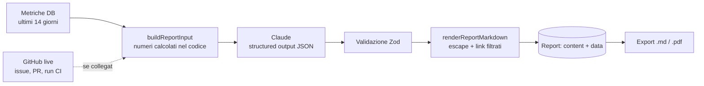

# DevOps Dashboard

Dashboard full-stack che monitora repository GitHub e genera report intelligenti con AI.
Progetto dimostrativo sviluppato interamente con Claude Code. Specifica completa in [`SPEC.md`](SPEC.md).

> **Stato:** Fase 4 (report AI) — oltre ad auth (Fase 2) e integrazione GitHub con metriche giornaliere (Fase 3), generazione di report settimanali con Claude (riassunto, tech debt, priorità), storico ed export Markdown/PDF. Frontend completo e notifiche arrivano nelle fasi successive.

## Stack

| Layer    | Tecnologia                                             |
| -------- | ------------------------------------------------------ |
| Frontend | React 19, TypeScript 5.9, Vite 8, Tailwind CSS 4       |
| Backend  | Node.js 22, Express 5, TypeScript 5.9, Zod 4, Pino 10  |
| Database | PostgreSQL 16, Prisma 6                                |
| Test     | Jest 30 + Supertest (backend), Vitest (frontend, unit) |
| CI       | GitHub Actions                                         |

## Struttura

```
frontend/   React + Vite        src/{components,pages,hooks,lib,api}
backend/    Express + Prisma    src/{routes,controllers,services,middleware,lib,config}, prisma/
.github/workflows/ci.yml
```

## Setup locale

Prerequisiti: Node 22, npm, PostgreSQL 16 in locale (o `docker run -e POSTGRES_PASSWORD=dev -p 5432:5432 postgres:16`).

```bash
# 1. Backend
cd backend
npm install
cp .env.example .env          # imposta DATABASE_URL, TEST_DATABASE_URL e JWT_ACCESS_SECRET
npx prisma migrate dev        # applica le migrazioni e genera il client
DATABASE_URL=<TEST_DATABASE_URL> npx prisma migrate deploy   # prepara il DB dei test
npm run db:seed               # 2 utenti demo, 3 repository, 90 giorni di metriche
npm run dev                   # http://localhost:4000/api/health

# 2. Frontend (altro terminale)
cd frontend
npm install
npm run dev                   # http://localhost:5173 (proxy /api -> :4000)
```

In ogni package: `npm run lint`, `npm run typecheck`, `npm test`, `npm run build`.
I test backend sono di integrazione e **svuotano** il database indicato in `TEST_DATABASE_URL`: usa un DB dedicato.

Utenti demo creati dal seed (solo per sviluppo): `demo@example.com` (ADMIN) e `user@example.com` (USER), password `demo-password`.

### Collegare GitHub

1. Imposta `GITHUB_TOKEN_ENC_KEY` nel `.env` (comando di generazione in `.env.example`). Senza chiave le route GitHub rispondono `503`.
2. Crea un [fine-grained personal access token](https://github.com/settings/personal-access-tokens/new) con accesso in sola lettura a **Metadata**, **Issues**, **Pull requests** e **Actions** sui repository da monitorare.
3. Dopo il login: `PUT /api/github/token` con `{ "token": "github_pat_..." }`, poi `POST /api/repos` con `{ "fullName": "owner/nome" }` e `POST /api/repos/:id/sync`.

Il sync automatico gira nel processo dell'API ogni `SYNC_INTERVAL_MINUTES` (default 360, `0` lo disattiva).

### Report AI

1. Imposta `ANTHROPIC_API_KEY` nel `.env` (chiave da [platform.claude.com](https://platform.claude.com)). Senza chiave `POST /api/reports` risponde `503 AI_NOT_CONFIGURED`; storico ed export funzionano comunque (il seed crea un report demo per repository).
2. `POST /api/reports` con `{ "repositoryId": "..." }`: la risposta arriva in 30-90 secondi.

Come nasce un report:



Variabili: `ANTHROPIC_MODEL` (default `claude-opus-5-5`), `REPORT_EFFORT` (default `high`), `REPORT_FALLBACKS` (default `true`), `REPORT_LANGUAGE` (default `English`), `REPORT_RATE_LIMIT` (generazioni per IP all'ora, default 10).

## API

| Metodo | Path                        | Descrizione                                                                               |
| ------ | --------------------------- | ----------------------------------------------------------------------------------------- |
| GET    | `/api/health`               | Stato API e database. `200` se il DB risponde, `503` (`degraded`) altrimenti              |
| POST   | `/api/auth/register`        | `{ email, password }` → `201 { user, accessToken }` + cookie refresh                      |
| POST   | `/api/auth/login`           | `{ email, password }` → `200 { user, accessToken }` + cookie refresh                      |
| POST   | `/api/auth/refresh`         | Usa il cookie `refresh_token`, lo ruota e restituisce un nuovo access token               |
| POST   | `/api/auth/logout`          | Revoca la sessione (family del refresh token) e cancella il cookie                        |
| GET    | `/api/auth/me`              | Utente corrente (`Authorization: Bearer <accessToken>`)                                   |
| POST   | `/api/auth/forgot-password` | `{ email }` → sempre `202`, invia il link se l'utente esiste                              |
| POST   | `/api/auth/reset-password`  | `{ token, password }` → `204`, revoca tutte le sessioni                                   |
| GET    | `/api/users`                | Lista utenti, solo ruolo `ADMIN`                                                          |
| GET    | `/api/github`               | Stato del collegamento GitHub `{ configured, connected, login }`                          |
| PUT    | `/api/github/token`         | `{ token }`: verifica il PAT su GitHub e lo salva cifrato                                 |
| DELETE | `/api/github/token`         | Scollega GitHub (`204`)                                                                   |
| GET    | `/api/repos`                | Repository tracciati, con l'ultima metrica                                                |
| GET    | `/api/repos/available`      | Repository GitHub dell'utente non ancora tracciati                                        |
| POST   | `/api/repos`                | `{ fullName: "owner/nome" }` → `201`, `409` se già tracciato                              |
| GET    | `/api/repos/:id`            | Dettaglio con stato del sync e ultima metrica                                             |
| DELETE | `/api/repos/:id`            | Smette di tracciare il repository (`204`)                                                 |
| GET    | `/api/repos/:id/metrics`    | `?from=YYYY-MM-DD&to=YYYY-MM-DD` (default ultimi 30 giorni, max 366)                      |
| POST   | `/api/repos/:id/sync`       | Sync manuale, `409` se già in corso; rate limit `SYNC_RATE_LIMIT`                         |
| GET    | `/api/reports`              | Storico: `?repositoryId&from&to&limit&offset` → `{ reports, total }` (senza `content`)    |
| POST   | `/api/reports`              | `{ repositoryId }` → `201 { report }`; `409` se già in generazione, `503` senza chiave AI |
| GET    | `/api/reports/:id`          | Report completo: `content` (Markdown) e `data` (JSON strutturato)                         |
| GET    | `/api/reports/:id/export`   | `?format=markdown\|pdf` → file allegato                                                   |
| DELETE | `/api/reports/:id`          | Elimina il report (`204`)                                                                 |

Le route `/api/github`, `/api/repos` e `/api/reports` richiedono `Authorization: Bearer <accessToken>`; un repository o un report di un altro utente risponde `404`.

Metriche giornaliere (UTC): `openIssues` e `openPRs` sono lo stato a fine giornata, `closedIssues` e `mergedPRs` i conteggi del giorno, `ciPassRate` è `success / (success + failure)` delle run GitHub Actions create quel giorno (`null` se non ce ne sono).

## Decisioni tecniche

- **PostgreSQL invece di MongoDB** — i dati sono fortemente relazionali (utente → repository → report/metriche) e le metriche giornaliere richiedono aggregazioni per intervallo di date, dove SQL e gli indici composti brillano. MongoDB scartato: avremmo riprodotto join e vincoli di unicità a livello applicativo.
- **Prisma invece di Drizzle/TypeORM** — schema dichiarativo unico, migrazioni generate e client completamente tipizzato senza decorator. Drizzle scartato: più vicino a SQL ma con migrazioni e tooling meno maturi; TypeORM scartato per tipizzazione debole e decorator.
- **Express invece di Fastify/Nest** — ecosistema di middleware più ampio (helmet, rate-limit, pino-http) e Express 5 gestisce nativamente le promise rifiutate. Fastify scartato: più veloce ma il collo di bottiglia qui sono GitHub e LLM, non il framework; Nest scartato: troppa cerimonia per un'API di queste dimensioni.
- **Prisma 6 invece di 7** — Prisma 7 richiede driver adapter e `prisma.config.ts`; per la fase base restiamo sulla linea stabile più diffusa, migrazione pianificata in seguito.
- **TypeScript 5.9 invece di 6** — ts-jest e typescript-eslint non dichiarano ancora il supporto a TS 6.
- **Probe del DB iniettabile in `createApp`** — permette di testare `/api/health` senza database reale. Alternativa scartata: mock globale del modulo Prisma, più fragile con ESM.
- **Vitest per i test unitari frontend** — condivide config e trasformazioni con Vite; Jest scartato lato frontend perché richiederebbe una pipeline di trasformazione separata. Playwright (E2E) arriverà in Fase 5.
- **Dark mode via classe `.dark`** — consente sia il default di sistema sia la scelta esplicita salvata in `localStorage`. Alternativa scartata: solo `prefers-color-scheme`, che non permette il toggle.
- **Access token JWT breve (15 min) + refresh token opaco in cookie httpOnly** — l'access token vive in memoria nel frontend, il refresh non è leggibile da JavaScript (mitiga XSS). Alternativa scartata: refresh JWT in `localStorage`, esposto a XSS e non revocabile.
- **Refresh token salvati come hash SHA-256, con rotazione e "family"** — un dump del DB non espone token utilizzabili; il riuso di un token già ruotato revoca l'intera sessione (rilevamento furto). SHA-256 invece di bcrypt perché i token sono casuali a 256 bit. Alternativa scartata: refresh JWT stateless, impossibile da revocare.
- **Cookie `SameSite=None; Secure` in produzione, `Lax` in sviluppo, `Path=/api/auth`** — frontend (Vercel) e API (Railway) sono su domini diversi; il path limita l'invio del cookie ai soli endpoint di auth.
- **bcryptjs invece di bcrypt nativo o argon2** — nessuna compilazione nativa in CI e su Railway; costo 12 round. Argon2 è più moderno ma richiede binding nativi. Password limitate a 72 byte (limite di bcrypt).
- **Risposte uniformi su login e forgot-password** — stesso errore per email inesistente o password errata, confronto con un hash fittizio per tempi simili, `202` sempre su forgot-password: niente user enumeration.
- **Test di integrazione su Postgres reale (`TEST_DATABASE_URL`)** — i flussi di auth dipendono da vincoli e transazioni del DB; un mock di Prisma avrebbe testato il mock. In CI il DB è un service container.
- **Email via interfaccia `EmailSender`** — Resend in produzione, sender finto nei test; senza `RESEND_API_KEY` non si invia nulla (in development il link finisce nei log).
- **`trust proxy` attivo in produzione** — dietro il proxy di Railway serve per far vedere al rate limiter l'IP reale del client.
- **Personal access token per utente invece di OAuth GitHub** — funziona senza registrare una OAuth App; il token è verificato su GitHub e salvato cifrato con AES-256-GCM (`GITHUB_TOKEN_ENC_KEY`), mai in chiaro. OAuth resta l'evoluzione naturale (vedi TODO).
- **REST v3 con Octokit invece di GraphQL v4** — endpoint semplici da simulare nei test e paginazione già gestita; GraphQL ridurrebbe le chiamate ma complica cache ETag e mock. Il client è dietro l'interfaccia `GitHubClient`, quindi sostituibile.
- **Endpoint issues invece della Search API** — la Search API ha un limite separato di 30 richieste al minuto; le issue aperte più quelle chiuse dall'inizio della finestra bastano a ricostruire lo stato giorno per giorno.
- **Cache ETag in-memory (`lru-cache`) invece di Redis** — con richieste condizionali GitHub risponde `304`, che per le richieste autenticate non consuma il rate limit primario. Un'istanza sola non giustifica Redis; le chiavi includono l'hash del token, quindi utenti diversi non condividono risposte.
- **Sync in-process con `setInterval` invece di `node-cron` o di una coda** — basta un intervallo, non un calendario; un lock ottimistico sul repository (`syncStatus` + `syncStartedAt`, ripreso dopo 15 minuti) evita sync concorrenti anche con più istanze. Una coda (BullMQ) servirà solo con molti repository.
- **Retry sul rate limit solo se l'attesa è ≤ 60 s** — il reset del limite primario può arrivare dopo un'ora: meglio fallire, salvare l'errore in `lastSyncError` e riprovare al giro successivo.
- **`ciPassRate` nullable** — un giorno senza run CI non è né 0% né 100%; `null` evita di falsare medie e grafici.
- **Claude Opus 5.5 con structured outputs invece di testo libero** — il modello restituisce JSON validato con Zod (riassunto, attività, tech debt, priorità); il Markdown lo costruisce il server. Formato stabile, testo escapato e link limitati agli URL presenti nei dati, così il modello non può inventare riferimenti. Alternativa scartata: chiedere direttamente Markdown, impossibile da validare e da filtrare.
- **I numeri li calcola il codice, non il modello** — `buildReportInput` conta issue, PR, run CI e seleziona tech debt candidato (issue aperte da 30+ giorni, PR ferme da 7+, workflow che falliscono) con funzioni pure testate; al modello chiediamo di interpretarli e di dare priorità. Liste limitate a 15 elementi per categoria, con il totale reale.
- **`create()` + Zod invece di `messages.parse()` dell'SDK** — `parse()` lancia un errore generico su JSON troncato prima che si possa leggere `stop_reason`; validando noi distinguiamo `AI_TRUNCATED`, `AI_REFUSED` e `AI_INVALID_OUTPUT`.
- **Fallback server-side (`fallbacks: "default"`)** — se i classificatori di sicurezza rifiutano la richiesta, l'API la ripete su un modello alternativo nella stessa chiamata; salviamo in `Report.model` il modello che ha risposto davvero. Disattivabile con `REPORT_FALLBACKS=false`.
- **Titoli di issue e PR trattati come dati non fidati** — arrivano nel prompt dentro `<repository_data>`, tagliati a 200 caratteri, con istruzione esplicita di non eseguirli (prompt injection).
- **Senza GitHub collegato il report usa solo le metriche** — così funziona anche sui dati del seed; il report lo dichiara e non elenca singole issue.
- **Generazione sincrona con lock per repository** — una richiesta HTTP di 30-90 s è accettabile per un'azione manuale; un `Set` in memoria impedisce due generazioni parallele dello stesso repository (`409`). Alternativa scartata per ora: coda di job con polling, necessaria con più istanze o generazioni schedulate (Fase 6).
- **PDF con pdfkit dal nostro Markdown** — libreria JS pura, nessun browser headless da installare su Railway. Rende solo il sottoinsieme di Markdown che generiamo noi; font standard Helvetica (caratteri non latini non supportati, vedi TODO).
- **`closedIssues` e `mergedPRs` sono conteggi giornalieri** — il seed della Fase 1 li trattava come cumulativi; ora seed e sync usano la stessa semantica, e i totali si ottengono sommando la serie.

## TODO

- Email: crea un account [Resend](https://resend.com), verifica un dominio e imposta `RESEND_API_KEY` e `EMAIL_FROM`. Senza chiave il reset password non invia email.
- OAuth GitHub (opzionale da spec): richiede una GitHub OAuth App (client id/secret) — non implementato; oggi si usa un personal access token.
- Webhook GitHub per aggiornamenti real-time (opzionale da spec): richiede un URL pubblico, dopo il deploy.
- `Repository.githubId` è `Int`: gli id GitHub sono oggi intorno a 1,4 miliardi, il limite è 2,1. Passare a `BigInt` prima che diventi un problema.
- Paginazione GitHub limitata a 10 pagine da 100 elementi per chiamata: repository con oltre 1000 issue aperte avranno metriche parziali (segnalato nei log).
- Pulizia periodica dei refresh/reset token scaduti (job schedulato).
- Report AI: crea una chiave API su [platform.claude.com](https://platform.claude.com) e imposta `ANTHROPIC_API_KEY`. La chiamata reale a Claude non è stata provata in sviluppo (nessuna chiave disponibile): i test esercitano l'SDK con risposte HTTP simulate.
- PDF: embeddare un font Unicode (es. Noto Sans) per titoli con caratteri non latini.
- Generazione report in background (coda + polling) quando arriveranno i report schedulati della Fase 6.

- Deploy (Fase 7): richiede account Railway (backend + Postgres) e Vercel (frontend) — da configurare dal maintainer.
